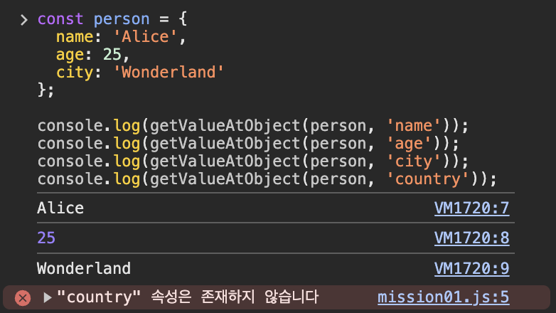
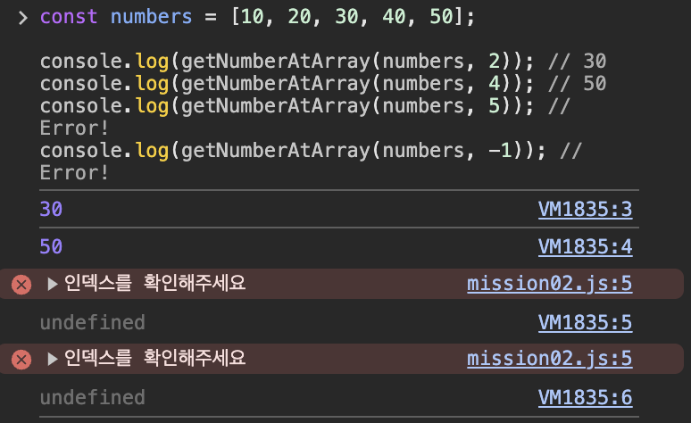

# 명재휘 과제 1 저장소입니다.

## 목차📌

1. [문제](#📝-문제-1)
   - [예시 코드](#예시-코드)
   - [구현](#구현)
   - [코드 설명](#코드-설명)
   - [결과](#결과)
2. [문제](#📝-문제-2)
   - [예시 코드](#예시-코드-1)
   - [구현](#구현-1)
   - [코드 설명](#코드-설명-1)
   - [결과](#결과-1)
3. [마치며](#마치며)

### 📝 문제 1.

객체에서 특정 키의 값을 안전하게 가져오는 함수를 작성하세요.

#### 예시 코드

```js
const person = {
  name: "Alice",
  age: 25,
  city: "Wonderland",
};

console.log(getValueAtObject(person, "name")); // 'Alice'
console.log(getValueAtObject(person, "age")); // 25
console.log(getValueAtObject(person, "city")); // 'Wonderland'
console.log(getValueAtObject(person, "country")); // Error !
```

#### 구현

```js
function getValueAtObject(obj, key) {
  if (key in obj) {
    return obj[key];
  } else {
    console.error(`"${key}" 속성은 존재하지 않습니다`);
    return;
  }
}
```

#### 코드 설명

1. 인자로 받은 obj에 key가 있는지 확인한 뒤 없다면 에러를 발생시킨다.
2. 있다면 해당 속성을 리턴한다.

#### 결과



### 📝 문제 2.

배열에서 특정 인덱스의 값을 안전하게 가져오는 함수를 작성하세요.

#### 예시 코드

```js
const numbers = [10, 20, 30, 40, 50];

console.log(getNumberAtArray(numbers, 2)); // 30
console.log(getNumberAtArray(numbers, 4)); // 50
console.log(getNumberAtArray(numbers, 5)); // Error!
console.log(getNumberAtArray(numbers, -1)); // Error!
```

#### 구현

```js
function getNumberAtArray(arr, index) {
  if (arr[index]) {
    return arr[index];
  } else {
    console.error("인덱스를 확인해주세요");
    return;
  }
}
```

#### 코드 설명

1. idx가 배열에 있는지 확인한 뒤 없다면 에러를 발생시킨다.
2. 있다면 해당 값을 반환한다.

#### 결과



### 마치며

1번 문제를 해결하며 처음에는 리턴을 <code>객체.속성</code> 형태로 사용하면 될 줄 알았다. 그런데 내 생각과는 다르게 <code> undefined</code>가 출력되었다.

검색을 해보니 MDN에서 이런 문장을 찾을 수 있었다.

> **MDN**
>
> 괄호 표기법에서는 property_name 으로 문자열이나 Symbol을 사용할 수 있습니다. 문자열은 유효한 식별자가 아니어도 괜찮습니다. "1foo", "!bar!", 심지어 " "(공백)도 가능합니다.

객체의 속성에 접근하는 방법이 한 가지 더 있다는 문장을 보고 괄호 표기법을 사용하니 원하는 결과가 나왔다.

왜 이런 결과가 나오는지 찾아보니 점 표기법과 괄호 표기법의 차이점에 있었다.

점 표기법은 실제 속성 이름을 사용하여 접근할수 있다. 즉 <code>변수를 사용하여 속성에 접근이 불가하다. </code>

하지만 괄호표기법은 <code>객체의 속성에 변수를 활용하여 접근할 수 있다.</code>

즉 매개변수인 key를 이용하여 속성에 직접 접근해야 하는 과제에서는 <code>괄호 표기법</code>을 사용해야 한다.

추가)

최근 타입 스크립트 공부를 시작했다. 그래서 이왕 하는 김에 TS로도 구현을 해볼까 하는 욕심이 생겼다.

사실 해봤자 매개변수에 타입만 주면 되지 않나 하는 생각이 있었지만 내 예상과는 다르게 1번 문제에서 에러가 발생했다.

원인은 TS에서는 기본적으로 객체의 속성을 읽을 때 string 타입을 허용하지 않는다.

즉, string literal 타입의 키로 접근하거나 인덱스 시그니처를 사용해야 한다.
