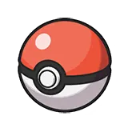

# 🔥 엘리멘탈 포스터 페이지 구현 💧

## 명재휘 과제 3


## 요구사항

1. 이벤트 처리 방식을 사용하여 클릭 이벤트를 걸어주세요.

```js
ul.addEventListener("click", (e) => {
  const li = e.target.closest("li");
});
```

2. 이미지와 색상의 데이터는 data.js 에서 불러와주세요.

```js
import { data } from "./data.js";
const characterData = data[index - 1];
```

3. 각 li 항목들을 클릭하면 배경 색상과 메인 비주얼 이미지를 변경해주세요.

```js
function setBgColor(color1, color2) {
  body.style.background = `linear-gradient(to bottom, ${color1}, ${color2})`;
}

function setImage(name) {
  image.src = `./assets/${name}.jpeg`;
  image.alt = name;
}

setBgColor(characterData.color[0], characterData.color[1]);
setImage(characterData.name);
```

4. 비주얼이 변경되면 상단에 비주얼에 맞는 이름으로 변경해주세요.

```js
function setNameText(name) {
  nickName.textContent = name;
}

setNameText(characterData.name);
```

5. 함수를 분리시켜주세요.

```js
function setBgColor(color1, color2) {
  body.style.background = `linear-gradient(to bottom, ${color1}, ${color2})`;
}

function setImage(name) {
  image.src = `./assets/${name}.jpeg`;
  image.alt = name;
}

function setNameText(name) {
  nickName.textContent = name;
}
```

---

## 포켓몬 페이지 구현



### 함수 설명 📝

1번 4번 7번을 url에 붙이는 함수 (스타팅 포켓몬 번호)

```js
function getPoketmon() {
  const url = [];
  for (let i = 1; i <= 7; i += 3) {
    url.push(`${END_POINT}/${i}`);
  }
  console.log(url);
  return url;
}
```

각 버튼에 불러온 이미지 렌더링하는 함수

```js
const url = getPoketmon();
const index = [];

function renderButton() {
  for (let i = 0; i < 3; i++) {
    console.log();

    index.push(url[i]);

    // 버튼 이미지
    getData(url[i]).then((res) => {
      insertLast(button[i], ``);
    });
  }
}
```

울음소리 가져오는 함수

```js
async function getCrise() {
  const crise = [];
  const audioList = [];

  for (let i = 0; i < 3; i++) {
    crise.push(url[i]);

    try {
      const res = await getData(url[i]);
      const cries = res.data.cries;
      const latestCryUrl = cries.latest;

      const audio = new Audio(latestCryUrl);
      audioList.push(audio);
    } catch {
      console.error("오류가 발생했습니다");
      alert("에러가 발생했습니다. 지연이 지속되면 문의 주시기 바랍니다. \n📞 010-0000-0000");
    }
  }

  return audioList;
}
```

이미지 변경함수

```js
function setImage(idx) {
  getData(url[idx - 1]).then((res) => {
    const image = getNode("img");
    image.src = `${res.data.sprites.other["official-artwork"].front_default}`;

    console.log(`../assets/bg${idx}.png`);
    body.style.backgroundColor = data[idx - 1];
    body.style.backgroundImage = "none";
    body.style.setProperty("--bg-image", `url("../assets/bg0${idx}.png")`);
  });
}
```

## 마치며

이번 과제를 하며 그동안 비동기처리를 어설프게 하고 있었다는 점을 느꼈다. 그래서 다시 처음부터 천천히 찾아보며 몰랐던 부분을 확실하게 짚고 넘어갈 수 있었던 것 같다.

또 포켓몬스터 부분에서 애니메이션을 넣는 부분이 생각보다 어려웠다. 그냥 opacity만 왔다갔다 하면 될 줄 알았지만 body에 있는 모든 요소들이 투명하게 보여 가상요소에 이미지를 넣어야 했다.

그런데 가상요소는 js에서 접근이 불가능해 어떻게 변경해야할지 고민하던 중 `claude` 이녀석이 변수를 사용해 이미지를 변경할 수 있다는 것을 알려줘서 적용할 수 있었다.

리드미를 쓰며 알았는데 엘리멘탈 mp3파일을 안넣었다. 으악
